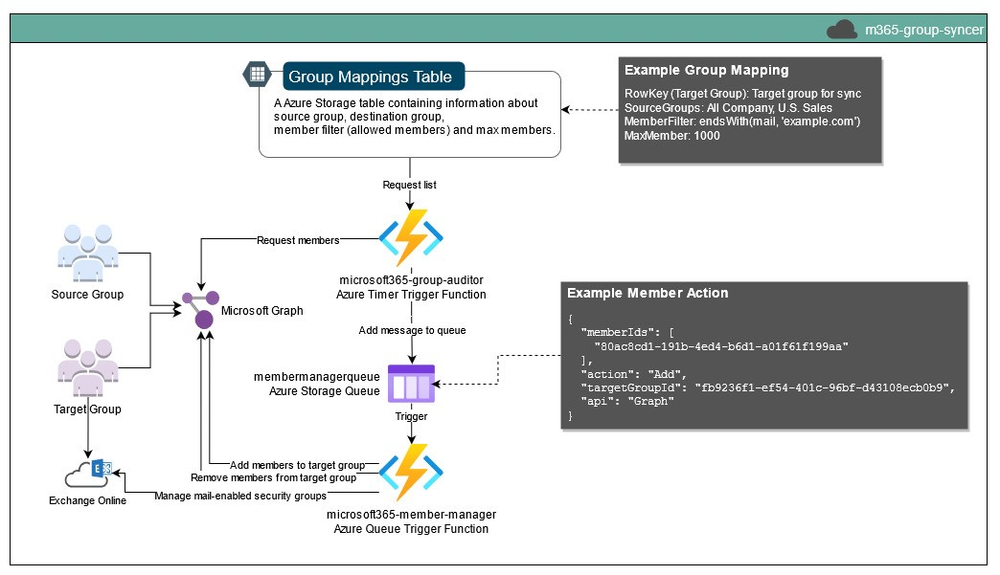

# m365-group-syncer <!-- omit in toc -->
A simple Azure Function to sync group members.
- [Overview](#overview)
- [Testing](#testing)
  - [Example local.settings.json](#example-localsettingsjson)
    - [Example with Azurite (Storage Account Emulator)](#example-with-azurite-storage-account-emulator)
  - [Example m365-member-manager queue message](#example-m365-member-manager-queue-message)
  - [Creating a certificate to test Graph authentication](#creating-a-certificate-to-test-graph-authentication)

# Overview


# Testing
## Example local.settings.json
### Example with Azurite (Storage Account Emulator)
```json
{
  "IsEncrypted": false,
  "Values": {
    "AzureWebJobsStorage": "DefaultEndpointsProtocol=http;AccountName=devstoreaccount1;AccountKey=Eby8vdM02xNOcqFlqUwJPLlmEtlCDXJ1OUzFT50uSRZ6IFsuFq2UVErCz4I6tq/K1SZFPTOtr/KBHBeksoGMGw==;BlobEndpoint=http://127.0.0.1:10000/devstoreaccount1;QueueEndpoint=http://127.0.0.1:10001/devstoreaccount1;",
    "FUNCTIONS_WORKER_RUNTIME_VERSION": "~7",
    "FUNCTIONS_WORKER_RUNTIME": "powershell",
    "STORAGE_TABLE_CONNECTION": "DefaultEndpointsProtocol=http;AccountName=devstoreaccount1;AccountKey=Eby8vdM02xNOcqFlqUwJPLlmEtlCDXJ1OUzFT50uSRZ6IFsuFq2UVErCz4I6tq/K1SZFPTOtr/KBHBeksoGMGw==;TableEndpoint=http://127.0.0.1:10002/devstoreaccount1;",
    "STORAGE_QUEUE_CONNECTION": "DefaultEndpointsProtocol=http;AccountName=devstoreaccount1;AccountKey=Eby8vdM02xNOcqFlqUwJPLlmEtlCDXJ1OUzFT50uSRZ6IFsuFq2UVErCz4I6tq/K1SZFPTOtr/KBHBeksoGMGw==;QueueEndpoint=http://127.0.0.1:10001/devstoreaccount1;",
    "GROUP_MAPPINGS_TABLE_NAME": "groupMappings",
    "INSERT_TEST_MAPPING": true,
    "AUTH_TENANT_NAME": "*.onmicrosoft.com",
    "AUTH_TENANT_ID": "",
    "AUTH_CLIENT_ID": "",
    "AUTH_CERTIFICATE_FILE": "m365-group-syncer.pfx"
  }
}
  
```

## Example m365-member-manager queue message
```json
{
  "memberIds": [
    "80ac8cd1-191b-4ed4-b6d1-a01f61f199aa"
  ],
  "action": "Add",
  "targetGroupId": "fb9236f1-ef54-401c-96bf-d43108ecb0b9"
}

```

## Creating a certificate to test Graph authentication
```bash
# Creating a self signed certificate
openssl genrsa -out m365-group-syncer.pem 2048
openssl req -new -key m365-group-syncer.pem -out m365-group-syncer.csr
openssl x509 -req -days 365 -in m365-group-syncer.csr -signkey m365-group-syncer.pem -out m365-group-syncer.crt
openssl pkcs12 -export -out m365-group-syncer.pfx -inkey m365-group-syncer.pem -in m365-group-syncer.crt
```